# Werkt dit proces

Onderstaande flowchart beschrijft het proces. Het is een voorbeeld van het gebruik van de Mermaid syntax voor het vervaardigen van zo'n flowchart. 

```mermaid
%%{init: {"flowchart": {"defaultRenderer": "elk"}} }%%
graph TD
    A([Start])---->B("<b>1.</b><br/>Is er sprake van hergebruik in de zin van de Who?<br/>Zie paragraaf 1.1.")

    B("<b>1.</b>Is er sprake van hergebruik in<br/>de zin van de Who?<br/>Zie paragraaf 1.1.")--- 1.Nee --->L("<b>Wijs het verzoek af</b>")

    B("<b>1.</b>Is er sprake van hergebruik in<br/>de zin van de Who?<br/>Zie paragraaf 1.1.")--- 1.Ja --->C("<b>2.</b>Is het verzoek gericht tot een<br/>met een publieke taak belaste instelling?<br/>Zie paragraaf3.1.")

    C("<b>2.</b>Is het verzoek gericht tot een<br/>met een publieke taak belaste instelling?<br/>Zie paragraaf3.1.")--- 2.Nee --->L("<b>Wijs het verzoek af</b>")

    C("<b>2.</b>Is het verzoek gericht tot een<br/>met een publieke taak belaste instelling?<br/>Zie paragraaf3.1.")
--- 2.Ja --->D("<b>3.</b>Is het verzoek afkomstig van een andere<br/>met een publieke taak belaste instelling?<br/>De uitwisseling van informatie tussen met een<br/>publieke taak belaste instellingen onderling<br/>is geen hergebruik van overheidsinformatie<br/>in de zin van de Who.")

    D("<b>3.</b>Is het verzoek afkomstig van een andere<br/>met een publieke taak belaste instelling?<br/>De uitwisseling van informatie tussen met een<br/>publieke taak belaste instellingen onderling<br/>is geen hergebruik van overheidsinformatie<br/>in de zin van de Who.")--- 3.Nee --->L("<b>Wijs het verzoek af</b>")

    D("<b>3.</b>Is het verzoek afkomstig van een andere<br/>met een publieke taak belaste instelling?<br/>De uitwisseling van informatie tussen met een<br/>publieke taak belaste instellingen onderling<br/>is geen hergebruik van overheidsinformatie<br/>in de zin van de Who.")--- 3.Ja --->E("<b>4.</b>"Berust de gevraagde informatie bij de met<br/>een publieke taak belaste instelling waartoe het verzoek is gericht?<br/>Indien mogelijk verwijst u door naar de instelling waar de informatie wel berust.)

    E("<b>4.</b>"Berust de gevraagde informatie bij de met<br/>een publieke taak belaste instelling waartoe het verzoek is gericht?<br/>Indien mogelijk verwijst u door naar de instelling<br/>waar de informatie wel berust.)--- 4.Nee --->L("<b>Wijs het verzoek af</b>")

    E("<b>4.</b>"Berust de gevraagde informatie bij de met<br/>een publieke taak belaste instelling waartoe het verzoek is gericht?<br/>Indien mogelijk verwijst u door naar de instelling<br/>waar de informatie wel berust.)--- 4.Ja ---> F("<b>5.</b>Is de informatie vergaard in het kader van een publieke taak?<br/>Het gaat om openbare informatie verkregen in het<br/>kader van de publieke taak van een met een publieke taak belaste instelling;<br/>direct of als bijproduct. Het gaat niet om informatie<br/>die voor interne bedrijfsvoering wordt gebruikt.")

    F("<b>5.</b>Is de informatie vergaard in het kader van een publieke taak?<br/>Het gaat om openbare informatie verkregen in het<br/>kader van de publieke taak van een met een publieke taak belaste instelling;<br/>direct of als bijproduct. Het gaat niet om informatie<br/>die voor interne bedrijfsvoering wordt gebruikt.")--- 5.Nee --->L("<b>Wijs het verzoek af</b>")

    F("<b>5.</b>Is de informatie vergaard in het kader van een publieke taak?<br/>Het gaat om openbare informatie verkregen in het<br/>kader van de publieke taak van een met een publieke taak belaste instelling;<br/>direct of als bijproduct. Het gaat niet om informatie<br/>die voor interne bedrijfsvoering wordt gebruikt.")--- 5.Ja --->G("<b>6.</b>Valt de verzochte informatie onder het<br/>toepassingsbereik van de Who?<br/>Uitgezonderde categorieën informatie zijn:<br/>a. Informatie die berust bij een publieke omroep,<br/>met een publieke omroeptaak belaste instelling of een<br/>instelling werkzaam onder de verantwoordelijkheid<br/>van een van deze instellingen;<br/>b. Informatie die berust bij een onderwijs- of onderzoeksinstelling;<br/>c. Informatie die berust bij andere culturele instellingen<br/>dan musea, bibliotheken (inclusief universiteitsbibliotheken) en archieven;<br/>d. Informatie die slechts logo’s of wapens<br/>en insignes of bevat.")

    G("<b>6.</b>Valt de verzochte informatie onder het<br/>toepassingsbereik van de Who?<br/>Uitgezonderde categorieën informatie zijn:<br/>a. Informatie die berust bij een publieke omroep,<br/>met een publieke omroeptaak belaste instelling of een<br/>instelling werkzaam onder de verantwoordelijkheid<br/>van een van deze instellingen;<br/>b. Informatie die berust bij een onderwijs- of onderzoeksinstelling;<br/>c. Informatie die berust bij andere culturele instellingen<br/>dan musea, bibliotheken (inclusief universiteitsbibliotheken) en archieven;<br/>d. Informatie die slechts logo’s of wapens<br/>en insignes of bevat.")-- 6.Nee --->L("<b>Wijs het verzoek af</b>")
---->X([Stop])

```

<figure>
    

<figcaption>Werkt het nu (Mermaid voorbeeld)</figcaption>
</figure>  
