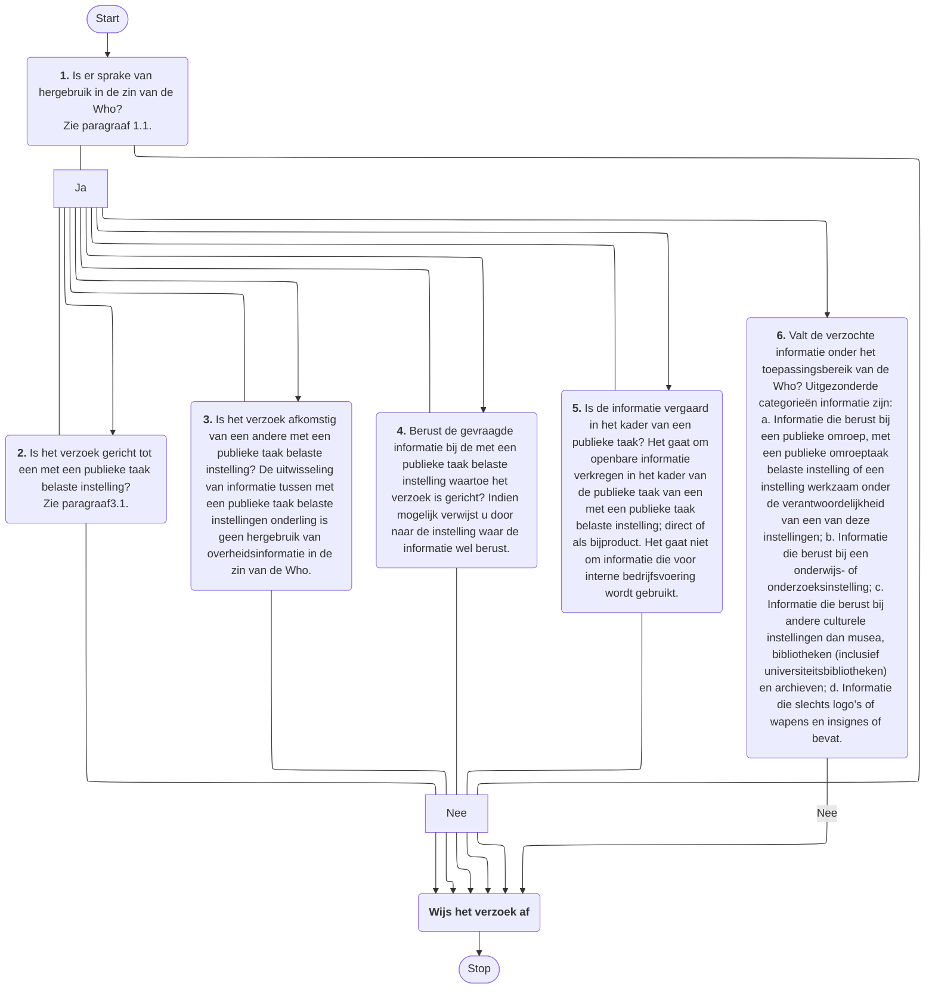

# Werkt dit proces

Onderstaande mermaid codes zijn voorbeelden van flowcharts. 

Er is blijkbaar een verschil tussen het gebruik van pijlen met 6 `-` streepjes met tekst zoals `--- Ja --->` en pijlen met maar 4 streepjes met tekst zoals `-- Ja -->`.
Zodra je de eerste variant gebruikt en een bepaalde pijl komt meerdere keren voor dan wordt deze in de gegenereerde flowchart ook meerdere keren gebruikt. Dat kan resulteren in een woud aan lijnen wat wellicht niet de bedoeling is, zie onderstaand voorbeeld:

<figure>
    

<figcaption>Eerste Mermaid voorbeeld met pijlen met 6 streepjes.</figcaption>
</figure>  

Om dit te voorkomen kun je 2 dingen doen:
* De tekst in de pijlen uniek maken, bijv. met nummers zoals hieronder:

```mermaid
%%{init: {"flowchart": {"defaultRenderer": "elk"}} }%%
graph TD
    A([Start])---->B("`**1.** Is er sprake van hergebruik in de zin van de Who?
    Zie paragraaf 1.1.`")

    B("`**1.** Is er sprake van hergebruik in de zin van de Who?
    Zie paragraaf 1.1.`")--- 1.Nee --->L("`**Wijs het verzoek af**`")

    B("`**1.** Is er sprake van hergebruik in de zin van de Who?
    Zie paragraaf 1.1.`")--- 1.Ja --->C("`**2.** Is het verzoek gericht tot een met een publieke taak belaste instelling?
    Zie paragraaf3.1.`")

    C("`**2.** Is het verzoek gericht tot een met een publieke taak belaste instelling?
    Zie paragraaf3.1.`")--- 2.Nee --->L("`**Wijs het verzoek af**`")

    C("`**2.** Is het verzoek gericht tot een met een publieke taak belaste instelling?
    Zie paragraaf3.1.`")
--- 2.Ja --->D("`**3.** Is het verzoek afkomstig van een andere met een publieke taak belaste instelling? De uitwisseling van informatie tussen met een publieke taak belaste instellingen onderling is geen hergebruik van overheidsinformatie in de zin van de Who.`")

    D("`**3.** Is het verzoek afkomstig van een andere met een publieke taak belaste instelling? De uitwisseling van informatie tussen met een publieke taak belaste instellingen onderling is geen hergebruik van overheidsinformatie in de zin van de Who.`")--- 3.Nee --->L("`**Wijs het verzoek af**`")

    D("`**3.** Is het verzoek afkomstig van een andere met een publieke taak belaste instelling? De uitwisseling van informatie tussen met een publieke taak belaste instellingen onderling is geen hergebruik van overheidsinformatie in de zin van de Who.`")--- 3.Ja --->E("`**4.** Berust de gevraagde informatie bij de met een publieke taak belaste instelling waartoe het verzoek is gericht? Indien mogelijk verwijst u door naar de instelling waar de informatie wel berust.`")

    E("`**4.** Berust de gevraagde informatie bij de met een publieke taak belaste instelling waartoe het verzoek is gericht? Indien mogelijk verwijst u door naar de instelling waar de informatie wel berust.`")--- 4.Nee --->L("`**Wijs het verzoek af**`")

    E("`**4.** Berust de gevraagde informatie bij de met een publieke taak belaste instelling waartoe het verzoek is gericht? Indien mogelijk verwijst u door naar de instelling waar de informatie wel berust.`")--- 4.Ja ---> F("`**5.** Is de informatie vergaard in het kader van een publieke taak? Het gaat om openbare informatie verkregen in het kader van de publieke taak van een met een publieke taak belaste instelling; direct of als bijproduct. Het gaat niet om informatie die voor interne bedrijfsvoering wordt gebruikt.`")

    F("`**5.** Is de informatie vergaard in het kader van een publieke taak? Het gaat om openbare informatie verkregen in het kader van de publieke taak van een met een publieke taak belaste instelling; direct of als bijproduct. Het gaat niet om informatie die voor interne bedrijfsvoering wordt gebruikt.`")--- 5.Nee --->L("`**Wijs het verzoek af**`")

    F("`**5.** Is de informatie vergaard in het kader van een publieke taak? Het gaat om openbare informatie verkregen in het kader van de publieke taak van een met een publieke taak belaste instelling; direct of als bijproduct. Het gaat niet om informatie die voor interne bedrijfsvoering wordt gebruikt.`")--- 5.Ja --->G("`**6.** Valt de verzochte informatie onder het toepassingsbereik van de Who? Uitgezonderde categorieën informatie zijn: a. Informatie die berust bij een publieke omroep, met een publieke omroeptaak belaste instelling of een instelling werkzaam onder de verantwoordelijkheid van een van deze instellingen; b. Informatie die berust bij een onderwijs- of onderzoeksinstelling; c. Informatie die berust bij andere culturele instellingen dan musea, bibliotheken (inclusief universiteitsbibliotheken) en archieven; d. Informatie die slechts logo’s of wapens en insignes of bevat.`")

    G("`**6.** Valt de verzochte informatie onder het toepassingsbereik van de Who? Uitgezonderde categorieën informatie zijn: a. Informatie die berust bij een publieke omroep, met een publieke omroeptaak belaste instelling of een instelling werkzaam onder de verantwoordelijkheid van een van deze instellingen; b. Informatie die berust bij een onderwijs- of onderzoeksinstelling; c. Informatie die berust bij andere culturele instellingen dan musea, bibliotheken (inclusief universiteitsbibliotheken) en archieven; d. Informatie die slechts logo’s of wapens en insignes of bevat.`")-- 6.Nee --->L("`**Wijs het verzoek af**`")
---->X([Stop])

```

<figure>
    

<figcaption>Tweede Mermaid voorbeeld met pijlen met 6 streepjes.</figcaption>
</figure>  

of pijlen met maar vier streepjes gebruiken.

```mermaid
%%{init: {"flowchart": {"defaultRenderer": "elk"}} }%%
graph TD
    A([Start])---->B("`**1.** Is er sprake van hergebruik in de zin van de Who?
    Zie paragraaf 1.1.`")

    B("`**1.** Is er sprake van hergebruik in de zin van de Who?
    Zie paragraaf 1.1.`")-- Nee -->L("`**Wijs het verzoek af**`")

    B("`**1.** Is er sprake van hergebruik in de zin van de Who?
    Zie paragraaf 1.1.`")-- Ja -->C("`**2.** Is het verzoek gericht tot een met een publieke taak belaste instelling?
    Zie paragraaf3.1.`")

    C("`**2.** Is het verzoek gericht tot een met een publieke taak belaste instelling?
    Zie paragraaf3.1.`")-- Nee -->L("`**Wijs het verzoek af**`")

    C("`**2.** Is het verzoek gericht tot een met een publieke taak belaste instelling?
    Zie paragraaf3.1.`")
-- Ja -->D("`**3.** Is het verzoek afkomstig van een andere met een publieke taak belaste instelling? De uitwisseling van informatie tussen met een publieke taak belaste instellingen onderling is geen hergebruik van overheidsinformatie in de zin van de Who.`")

    D("`**3.** Is het verzoek afkomstig van een andere met een publieke taak belaste instelling? De uitwisseling van informatie tussen met een publieke taak belaste instellingen onderling is geen hergebruik van overheidsinformatie in de zin van de Who.`")-- Nee -->L("`**Wijs het verzoek af**`")

    D("`**3.** Is het verzoek afkomstig van een andere met een publieke taak belaste instelling? De uitwisseling van informatie tussen met een publieke taak belaste instellingen onderling is geen hergebruik van overheidsinformatie in de zin van de Who.`")-- Ja -->E("`**4.** Berust de gevraagde informatie bij de met een publieke taak belaste instelling waartoe het verzoek is gericht? Indien mogelijk verwijst u door naar de instelling waar de informatie wel berust.`")

    E("`**4.** Berust de gevraagde informatie bij de met een publieke taak belaste instelling waartoe het verzoek is gericht? Indien mogelijk verwijst u door naar de instelling waar de informatie wel berust.`")-- Nee -->L("`**Wijs het verzoek af**`")

    E("`**4.** Berust de gevraagde informatie bij de met een publieke taak belaste instelling waartoe het verzoek is gericht? Indien mogelijk verwijst u door naar de instelling waar de informatie wel berust.`")-- Ja --> F("`**5.** Is de informatie vergaard in het kader van een publieke taak? Het gaat om openbare informatie verkregen in het kader van de publieke taak van een met een publieke taak belaste instelling; direct of als bijproduct. Het gaat niet om informatie die voor interne bedrijfsvoering wordt gebruikt.`")

    F("`**5.** Is de informatie vergaard in het kader van een publieke taak? Het gaat om openbare informatie verkregen in het kader van de publieke taak van een met een publieke taak belaste instelling; direct of als bijproduct. Het gaat niet om informatie die voor interne bedrijfsvoering wordt gebruikt.`")-- Nee -->L("`**Wijs het verzoek af**`")

    F("`**5.** Is de informatie vergaard in het kader van een publieke taak? Het gaat om openbare informatie verkregen in het kader van de publieke taak van een met een publieke taak belaste instelling; direct of als bijproduct. Het gaat niet om informatie die voor interne bedrijfsvoering wordt gebruikt.`")-- Ja -->G("`**6.** Valt de verzochte informatie onder het toepassingsbereik van de Who? Uitgezonderde categorieën informatie zijn: a. Informatie die berust bij een publieke omroep, met een publieke omroeptaak belaste instelling of een instelling werkzaam onder de verantwoordelijkheid van een van deze instellingen; b. Informatie die berust bij een onderwijs- of onderzoeksinstelling; c. Informatie die berust bij andere culturele instellingen dan musea, bibliotheken (inclusief universiteitsbibliotheken) en archieven; d. Informatie die slechts logo’s of wapens en insignes of bevat.`")

    G("`**6.** Valt de verzochte informatie onder het toepassingsbereik van de Who? Uitgezonderde categorieën informatie zijn: a. Informatie die berust bij een publieke omroep, met een publieke omroeptaak belaste instelling of een instelling werkzaam onder de verantwoordelijkheid van een van deze instellingen; b. Informatie die berust bij een onderwijs- of onderzoeksinstelling; c. Informatie die berust bij andere culturele instellingen dan musea, bibliotheken (inclusief universiteitsbibliotheken) en archieven; d. Informatie die slechts logo’s of wapens en insignes of bevat.`")-- Nee -->L("`**Wijs het verzoek af**`")
---->X([Stop])

```

<figure>
    

<figcaption>Eerste Mermaid voorbeeld met pijlen met 4 streepjes.</figcaption>
</figure>  
